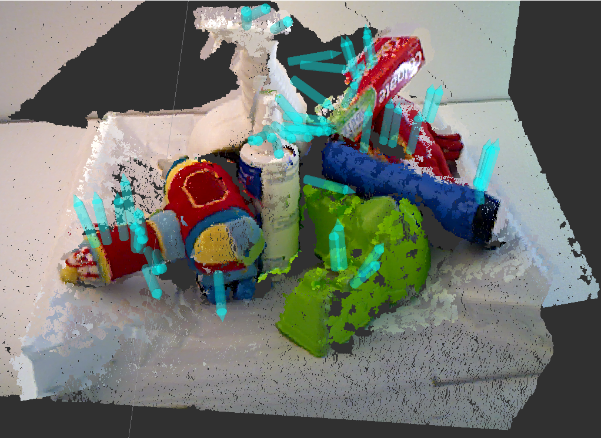

# grasp_selection

* **Author:** Andreas ten Pas (atp@ccs.neu.edu)
* **Version:** 1.0.0
* **Author's website:** [http://www.ccs.neu.edu/home/atp/](http://www.ccs.neu.edu/home/atp/)


## 1) Overview
This package selects a subset of grasps from the grasps produced by the 
[agile_grasp](http://wiki.ros.org/agile_grasp) package. The grasps are selected based on three different scoring 
functions that take into account:

1. how easy it is to reach the grasp with the robot arm,
2. how easy it is to perform the grasp with the robot hand, and
3. how far the robot arm has to travel through the robot's workspace.

<a href="./readme/rviz1.png"></a>
	
This package consists of one ROS node: *select_grasps*.


## 2) Requirements
1. [ROS Hydro](http://wiki.ros.org/hydro) or [ROS Indigo](http://wiki.ros.org/indigo)
2. [agile_grasp](http://wiki.ros.org/agile_grasp) package


## 3) Installation

### From Source, ROS Indigo
1. Open a terminal
2. Navigate to the *src* folder of your ROS workspace: `$ cd location_of_workspace/src`
2. Clone the repository: `$ git clone https://github.com/atenpas/grasp_selection.git`
3. Navigate back to the root of your ROS workspace: `$ cd ..`
4. Recompile your ROS workspace: `$ catkin_make`

### From Source, ROS Hydro
Same as *3.1*, except for Step (3): `$ git clone https://github.com/atenpas/grasp_selection.git -b hydro`


## 4) Usage
The easiest way to use this package is:

```
roslaunch grasp_selection select_grasps.launch
```

The node works by first testing each grasp for reachability. All the remaining grasps are then scored according to the 
three scoring functions listed above. The node finally selects the *k* top scoring grasps.


### Parameters

The parameters in the ROS launch file *select_grasps.launch* are described below.

#### General

* cloud_topic: the ROS topic at which the input point cloud for *agile_grasp* is published (used for collision avoidance)
* grasps_topic: the ROS topic where *agile_grasp* publishes the grasps
* joint_states_topic: the ROS topic for [joint states](http://wiki.ros.org/joint_state_publisher)
* marker_lifetime: the lifetime of visual markers in Rviz
* use_scoring: whether the grasps are scored

#### Reachability

* workspace: the dimensions of the robot's workspace
* min_aperture: the minimum aperture of the robot hand
* max_aperture: the maximum aperture of the robot hand
* axis_order: the ordering of the axes of the robot hande frame (e.g., [2, 0, 1] for the Baxter research robot)
* planning_frame: the planning frame of the robot
* hand_offset: the distance between the finger tip and the base of the robot hand
* num_additional_grasps: the number of additional grasps that is produced
* arm_link: name of the robot arm end effector link (required by MoveIt)
* move_group: name of the robot arm "move group" (required by MoveIt)
* max_colliding_points: the maximum number of points that is allowed to be in collision
* JS_first_joint_index: the index of the first arm joint on the *joint_states* ROS topic
* JS_last_joint_index: the index of the last arm joint on the *joint_states* ROS topic
* IK_first_joint_index: the index of the first arm joint in the IK solver's solution 
* IK_last_joint_index: the index of the last arm joint in the IK solver's solution
* prints: whether additional information is printed during reachability tests

#### Scoring

* urdf: the location of the URDF file
* num_selected: the number of selected grasps
